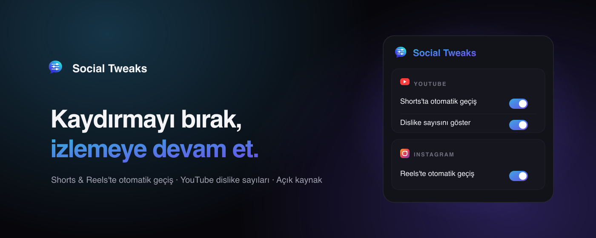
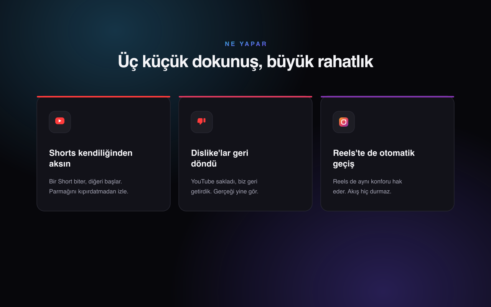

<div align="center">



<h1>Social Tweaks</h1>

<p><strong>Kaydırmayı bırak, izlemeye devam et.</strong><br/>
Sosyal medya deneyimini iyileştiren küçük ayarlar bütünü — tek bir Chrome eklentisi.</p>

<p>
  <a href="https://socialtweaks.online"></a>
  <a href="https://chromewebstore.google.com/detail/efcmpoackpiboanhogobadabplpobkjj"></a>
</p>

<p>
  
  
  
  
</p>

<p>
  <a href="https://socialtweaks.online">🌐 Web sitesi</a> &nbsp;·&nbsp;
  <a href="https://chromewebstore.google.com/detail/efcmpoackpiboanhogobadabplpobkjj">🧩 Eklentiyi yükle</a> &nbsp;·&nbsp;
  <a href="#-nasıl-çalışır">⚙️ Nasıl çalışır</a> &nbsp;·&nbsp;
  <a href="https://socialtweaks.online/privacy.html">🔒 Gizlilik</a>
</p>

</div>

---

## ✨ Ne yapar?

<table>
  <tr>
    <td width="33%" valign="top">
      <h3>▶️ Shorts otomatik geçiş</h3>
      Bir YouTube Short biter, diğeri başlar. Parmağını kıpırdatmadan izle.
    </td>
    <td width="33%" valign="top">
      <h3>👎 Dislike'lar geri döndü</h3>
      YouTube sakladı, biz geri getirdik. Dislike sayısını tekrar gör.
    </td>
    <td width="33%" valign="top">
      <h3>📸 Reels otomatik geçiş</h3>
      Instagram Reels de aynı konforu hak eder. Akış hiç durmaz.
    </td>
  </tr>
</table>

<div align="center">
  
</div>

Tüm ayarlar popup üzerinden **tek tıkla aç/kapa** edilebilir ve `chrome.storage.sync`
ile kaydedilir — değişiklikler anında uygulanır.

<div align="center">
  
</div>

---

## ⚙️ Nasıl çalışır?

### ▶️ YouTube Shorts — Otomatik geçiş
Shorts videoları varsayılan olarak sonsuz döngüde (`loop`) oynadığı için normal
`ended` olayı tetiklenmez. Eklenti aktif video'yu bulur, `loop`'u kapatır ve hem
`ended` hem de süre sonu (`timeupdate`) durumunu izler. Geçiş, YouTube'un dinlediği
`ArrowDown` klavye olayıyla; o işe yaramazsa aşağı yön navigasyon butonuna tıklanarak
yapılır. Detaylar: [`src/content.ts`](src/content.ts).

### 👎 YouTube — Dislike sayısı
[`src/dislikes.ts`](src/dislikes.ts), video sayfasındaki `v` parametresinden video
ID'sini alır ve [`src/background.ts`](src/background.ts)'a mesaj göndererek dislike
sayısını sorar. İstek background service worker'dan yapılır (içerik script'lerinde
sayfanın CSP'si nedeniyle dış API'ye `fetch` güvenilir değildir). Sonuç, dislike
butonunun yanına bir etiket olarak eklenir; video değişimleri `yt-navigate-finish`
olayıyla yakalanır. Sayı, [returnyoutubedislike.com](https://returnyoutubedislike.com)
servisinden alınır (bkz. [Anarios/return-youtube-dislike](https://github.com/Anarios/return-youtube-dislike)).

### 📸 Instagram Reels — Otomatik geçiş
[`src/instagram.ts`](src/instagram.ts), YouTube Shorts ile aynı mantığı izler:
ekranda görünen Reel videosunun `loop`'unu kapatır, `ended` ve `timeupdate` ile
video sonunu yakalar. Geçiş için önce `ArrowDown` klavye olayı gönderilir; işe
yaramazsa videoyu içeren kaydırılabilir alan bir ekran yüksekliği kaydırılır.

---

## 📥 Chrome'a yükleme

**En kolay yol —** [Chrome Web Store'dan yükle](https://chromewebstore.google.com/detail/efcmpoackpiboanhogobadabplpobkjj).

<details>
<summary><strong>Geliştirici modu ile elle yükleme</strong></summary>

1. `npm run build` çalıştır.
2. `chrome://extensions` adresine git.
3. Sağ üstten **Developer mode**'u aç.
4. **Load unpacked** → bu projedeki `dist/` klasörünü seç.
5. Bir sayfa aç:
   - Shorts: `https://www.youtube.com/shorts/...`
   - Video: `https://www.youtube.com/watch?v=...`
   - Reels: `https://www.instagram.com/reels/...`

> Not: `npm run dev` kullanırsan `dist/` yerine Vite'ın ürettiği klasörü yükle;
> üretim için `npm run build` önerilir.

</details>

---

## 🛠️ Geliştirme

```bash
npm install
npm run build      # dist/ klasörünü üretir (tsc tip kontrolü + vite build)
npm run dev        # geliştirme + HMR
```

İkonları yeniden üretmek için: `node scripts/generate-icons.mjs`.

### 📂 Proje yapısı

```
src/
├── manifest.ts        # MV3 manifest tanımı
├── content.ts         # Shorts otomatik geçiş mantığı
├── instagram.ts       # Instagram Reels otomatik geçiş mantığı
├── dislikes.ts        # Dislike sayısı gösterimi (content script)
├── background.ts      # Dislike API isteklerini yapan service worker
├── messages.ts        # content <-> background mesaj tipleri
├── settings.ts        # Ayar tipi + storage yardımcıları
├── popup/             # Toggle + ayar arayüzü
└── icons/             # Üretilen ikonlar
```

---

## 🔒 Gizlilik

Bu eklenti kendi sunucularına hiçbir veri göndermez, analitik/izleme içermez.
Ayarların (`enabled`, `showDislikes`, `instagramEnabled`) tek saklandığı yer
tarayıcının `chrome.storage.sync` alanıdır.

"Dislike sayısını göster" özelliği **açıkken**, izlediğin videonun ID'si dislike
sayısını almak için [returnyoutubedislikeapi.com](https://returnyoutubedislikeapi.com)'a
gönderilir (üçüncü taraf bir servistir). Bu özelliği popup'tan kapatırsan hiçbir
istek yapılmaz.

Eklenti yalnızca `https://www.youtube.com/shorts/*`, `https://www.youtube.com/watch*`
ve `https://www.instagram.com/reel(s)/*` sayfalarında çalışır.

Tam metin: [socialtweaks.online/privacy.html](https://socialtweaks.online/privacy.html)

---

<div align="center">
  <sub>MIT lisansı ile açık kaynak · <a href="https://socialtweaks.online">socialtweaks.online</a></sub>
</div>
