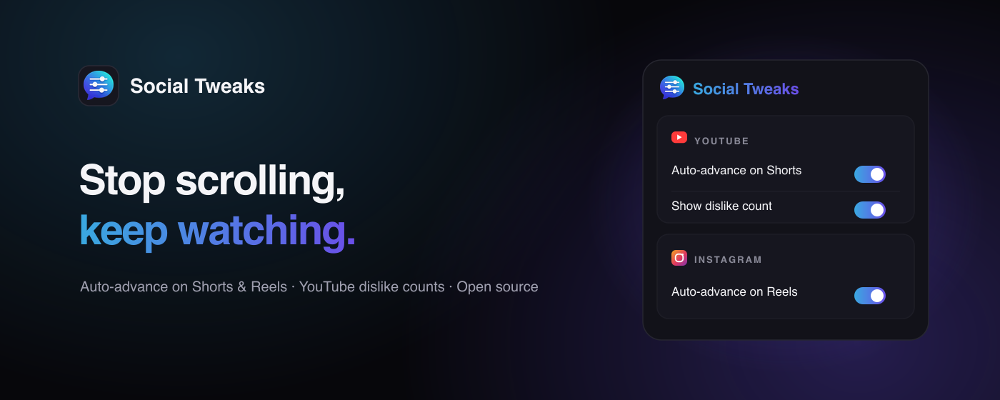
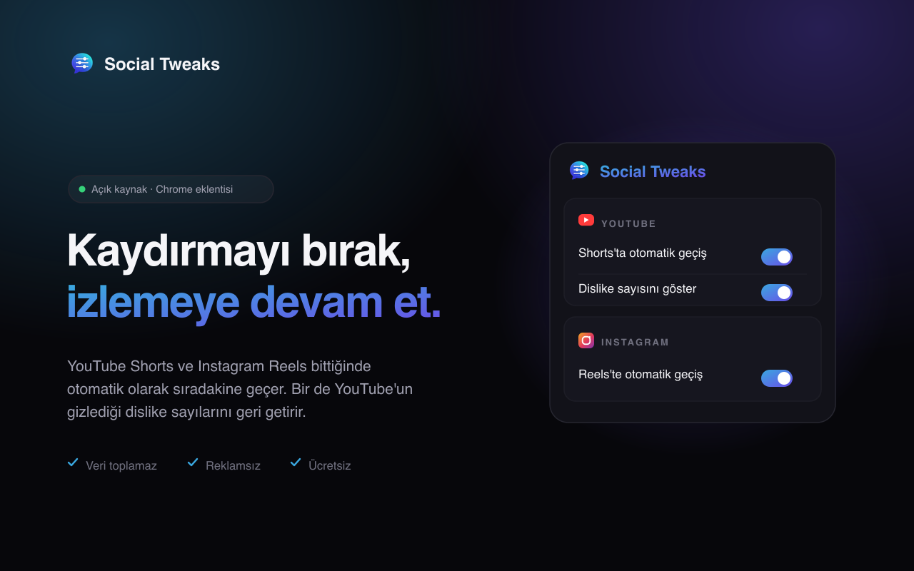

<div align="center">



<h1>Social Tweaks</h1>

<p><strong>English</strong> · <a href="README.tr.md">Türkçe</a></p>

<p><strong>Stop scrolling, keep watching.</strong><br/>
A small set of tweaks that make your social media experience better — in a single Chrome extension.</p>

<p>
  <a href="https://socialtweaks.online"></a>
  <a href="https://chromewebstore.google.com/detail/efcmpoackpiboanhogobadabplpobkjj"></a>
</p>

<p>
  
  
  
  
</p>

<p>
  <a href="https://socialtweaks.online">🌐 Website</a> &nbsp;·&nbsp;
  <a href="https://chromewebstore.google.com/detail/efcmpoackpiboanhogobadabplpobkjj">🧩 Install the extension</a> &nbsp;·&nbsp;
  <a href="#-how-it-works">⚙️ How it works</a> &nbsp;·&nbsp;
  <a href="https://socialtweaks.online/privacy.html">🔒 Privacy</a>
</p>

</div>

---

## ✨ What it does

<table>
  <tr>
    <td width="25%" valign="top">
      <h3>▶️ Auto-advance on Shorts</h3>
      One YouTube Short ends, the next begins. Watch without lifting a finger.
    </td>
    <td width="25%" valign="top">
      <h3>👎 Dislikes are back</h3>
      YouTube hid the count, we brought it back. See the dislike number again.
    </td>
    <td width="25%" valign="top">
      <h3>🪟 Video pop-out</h3>
      Move a regular YouTube video into Chrome's native Picture-in-Picture window.
    </td>
    <td width="25%" valign="top">
      <h3>📸 Auto-advance on Reels</h3>
      Instagram Reels deserve the same comfort. The feed never stops.
    </td>
  </tr>
</table>

Every setting can be toggled **on or off with one click** from the popup and is saved
via `chrome.storage.sync` — changes apply instantly.

<div align="center">
  
</div>

---

## ⚙️ How it works

### ▶️ YouTube Shorts — Auto-advance
Shorts play on an infinite `loop` by default, so the regular `ended` event never
fires. The extension finds the active video, disables its `loop`, and watches both
`ended` and end-of-duration (`timeupdate`) states. Advancing is done via the
`ArrowDown` keyboard event YouTube already listens for; if that fails, it clicks the
down-navigation button. Details: [`src/content.ts`](src/content.ts).

### 👎 YouTube — Dislike count
[`src/dislikes.ts`](src/dislikes.ts) reads the video ID from the `v` parameter on the
watch page and messages [`src/background.ts`](src/background.ts) to fetch the dislike
count. The request runs from the background service worker (a `fetch` to an external
API from content scripts is unreliable due to the page's CSP). The result is added as
a label next to the dislike button; video changes are caught via the
`yt-navigate-finish` event. The count comes from
[returnyoutubedislike.com](https://returnyoutubedislike.com)
(see [Anarios/return-youtube-dislike](https://github.com/Anarios/return-youtube-dislike)).

### 🪟 YouTube — Video pop-out
[`src/youtube-popout.ts`](src/youtube-popout.ts) loads on `https://www.youtube.com/*`
so it survives YouTube's SPA navigation, but it only renders a button when
`location.pathname === "/watch"`. The button uses the native
`requestPictureInPicture()` API on the current YouTube `<video>` element after
checking browser support, video readiness and whether PiP is disabled for that video.

### 📸 Instagram Reels — Auto-advance
[`src/instagram.ts`](src/instagram.ts) follows the same logic as YouTube Shorts: it
disables the `loop` on the on-screen Reel and detects the end via `ended` and
`timeupdate`. To advance, it first dispatches an `ArrowDown` keyboard event; if that
doesn't work, it scrolls the Reel's scrollable container by one screen height.

---

## 📥 Install on Chrome

**Easiest way —** [install from the Chrome Web Store](https://chromewebstore.google.com/detail/efcmpoackpiboanhogobadabplpobkjj).

<details>
<summary><strong>Manual install via developer mode</strong></summary>

1. Run `npm run build`.
2. Go to `chrome://extensions`.
3. Enable **Developer mode** (top right).
4. **Load unpacked** → select the `dist/` folder in this project.
5. Open a page:
   - Shorts: `https://www.youtube.com/shorts/...`
   - Video: `https://www.youtube.com/watch?v=...`
   - Reels: `https://www.instagram.com/reels/...`

> Note: if you use `npm run dev`, load the folder Vite produces instead of `dist/`;
> `npm run build` is recommended for production.

</details>

---

## 🛠️ Development

```bash
npm install
npm run build      # produces the dist/ folder (tsc type-check + vite build)
npm run dev        # development + HMR
```

To regenerate icons: `node scripts/generate-icons.mjs`.
To regenerate marketing images (OG + banner, TR & EN): `node scripts/generate-images.mjs`.

### 📂 Project structure

```
src/
├── manifest.ts        # MV3 manifest definition
├── content.ts         # Shorts auto-advance logic
├── instagram.ts       # Instagram Reels auto-advance logic
├── dislikes.ts        # Dislike count display (content script)
├── youtube-popout.ts  # YouTube Picture-in-Picture button (content script)
├── background.ts      # Service worker that makes dislike API requests
├── messages.ts        # content <-> background message types
├── settings.ts        # Settings type + storage helpers
├── popup/             # Toggle + settings interface
└── icons/             # Generated icons
```

Localization lives in `public/_locales/{en,tr}/messages.json` — Chrome picks the
language automatically from the browser's UI language (English is the fallback).

---

## 🔒 Privacy

This extension sends no data to its own servers and contains no analytics or tracking.
Your settings (`enabled`, `showDislikes`, `youtubePopoutButtonEnabled`,
`instagramEnabled`) are stored only in the browser's `chrome.storage.sync` area.

**When** the "Show dislike count" feature is on, the ID of the video you're watching is
sent to [returnyoutubedislikeapi.com](https://returnyoutubedislikeapi.com) to fetch the
dislike count (a third-party service). Turn that feature off in the popup and no
requests are made.

The extension loads its content scripts on `https://www.youtube.com/*` and
`https://www.instagram.com/*` for SPA compatibility. Each feature activates only on
its relevant watch, Shorts, or Reels page.

Full text: [socialtweaks.online/privacy.html](https://socialtweaks.online/privacy.html)

---

<div align="center">
  <sub>Open source under the MIT license · <a href="https://socialtweaks.online">socialtweaks.online</a></sub>
</div>
